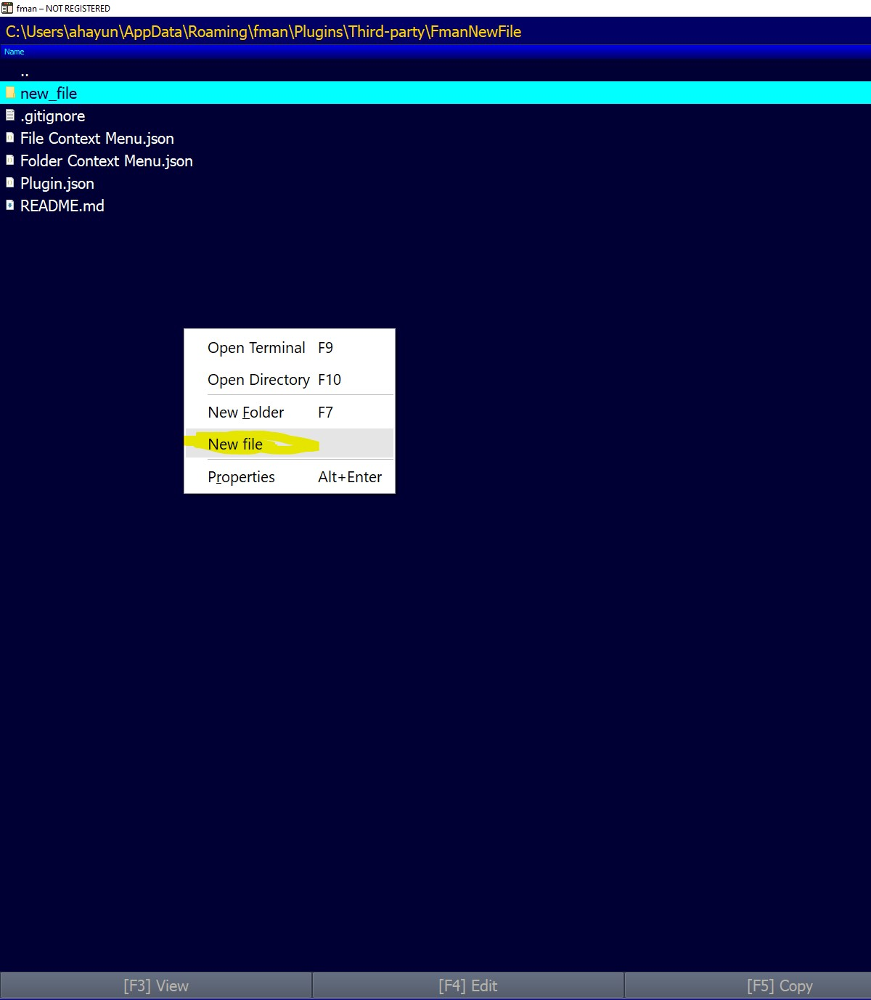

# FmanNewFile

Plugin for [fman.io](https://fman.io) to create new file via context menu.

Install with [fman's built-in command for installing plugins](https://fman.io/docs/installing-plugins).

## Usage

Open context menu and click at "New file".

## Screenshots
### "New File" entry in the folder context menu
  

### "New File" entry in the file context menu
  

### Showing the plugin in action
  
